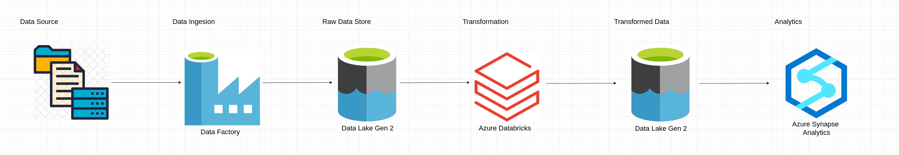

# Azure Olympic ETL Project

A data pipeline  using Azure Data Factory, Data Lake Gen 2, Synapse Analytics, and Azure Databricks

## Description

### Objective

The goal of this data engineering project is to to collect, clean, and analyze data from the Olympics. We are using GitHub as a data source and Azure Data Lake Gen2 Storage as a data destination. We are using Azure Data Factory to orchestrate the data pipeline and Azure Databricks to refine the data.

### Dataset

We can use any dataset, we are mainly interested in operation side of Data Engineering (building data pipeline)

Here is the datasets we used  - [Link](https://github.com/aditishraq/Azure-Olympic-ETL-Pipeline/tree/main/data)

### Tools & Technologies

- Cloud - [**Azure**](https://azure.microsoft.com/en-us/free)

- Transformation - [**Azure Databricks**]( https://www.mage.ai/)
- Data Ingension  - [**Azure Data Factory**](https://cloud.google.com/storage)
- Data Analytics - [**Azure Synapse Analytics**](https://datastudio.google.com/overview)
- Language - [**Python**](https://www.python.org)

### Architecture

## Setup

### Pre-requisites

If you already have a Azure account, you can skip the pre-requisite steps.

- Azure Cloud Platform. 
  - [Azure Account and Access Setup](https://k21academy.com/microsoft-azure/create-free-microsoft-azure-trial-account/)

